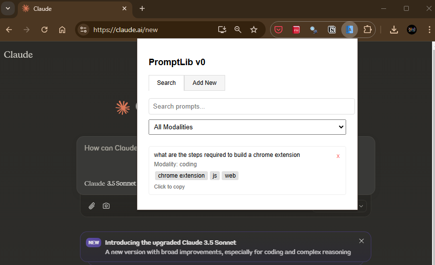

# PromptLib


PromptLib is a Chrome extension designed to help users save, organize, and reuse their AI prompts.

## Features

- 🔍 **Quick Search**: Instantly find prompts using keywords
- 🏷️ **Tag Organization**: Categorize prompts with custom tags
- 📝 **Modality Classification**: Organize prompts by their purpose (General, Coding, Writing, Analysis)
- 📋 **One-Click Copy**: Copy prompts to clipboard with a single click
- 🔄 **Chrome Sync**: Automatically sync prompts across devices

- Sample



## Installation

### Local Development
1. Clone the repository
   ```bash
   git clone https://github.com/ndamulelonemakh/promptlib.git
   cd promptlib
   ```

2. Load the extension in Chrome:
   - Open Chrome and navigate to `chrome://extensions/`
   - Enable "Developer mode" in the top right
   - Click "Load unpacked"
   - Select the project directory

### From Chrome Web Store
*(Coming soon)*

## Usage

1. **Adding Prompts**
   - Click the PromptLib extension icon
   - Switch to the "Add New" tab
   - Enter your prompt text
   - Select a modality
   - Add relevant tags (comma-separated)
   - Click "Save"

2. **Finding Prompts**
   - Open the extension
   - Use the search bar to find prompts by content or tags
   - Filter by modality using the dropdown
   - Click any prompt to copy it to your clipboard

3. **Managing Prompts**
   - Delete prompts using the × icon
   - Tags and modalities help keep prompts organized
   - All prompts sync across your Chrome instances

## Project Structure

```
promptlib/
├── manifest.json      # Extension manifest
├── popup.html        # Main extension interface
├── popup.js          # Interface functionality
├── content.js        # Page interaction script
└── README.md         # Documentation
```

## Technologies Used

- HTML5
- CSS3
- JavaScript (ES6+)
- Chrome Extension APIs
- Chrome Storage Sync API

## Contributing

Contributions are welcome! Here's how you can help:

1. Fork the repository
2. Create a feature branch (`git checkout -b feature/AmazingFeature`)
3. Commit your changes (`git commit -m 'Add some AmazingFeature'`)
4. Push to the branch (`git push origin feature/AmazingFeature`)
5. Open a Pull Request

Please ensure your PR description clearly describes the changes and links to any relevant issues.

### Development Guidelines

- Follow existing code style and conventions
- Add comments for complex logic
- Update documentation as needed
- Test thoroughly before submitting PRs

## Future Enhancements

- [ ] Auto-capture prompts from AI interfaces
- [ ] Export/import functionality
- [ ] Advanced categorization options
- [ ] Cloud backup options
- [ ] Keyboard shortcuts

## License

This project is licensed under the MIT License - see the [LICENSE](LICENSE) file for details.

## Acknowledgments

- Special thanks to all contributors

## Support

For support, please:
- Open an issue on GitHub

---

Made with ❤️ by [ndamulelonemakh](https://github.com/ndamulelonemakh)